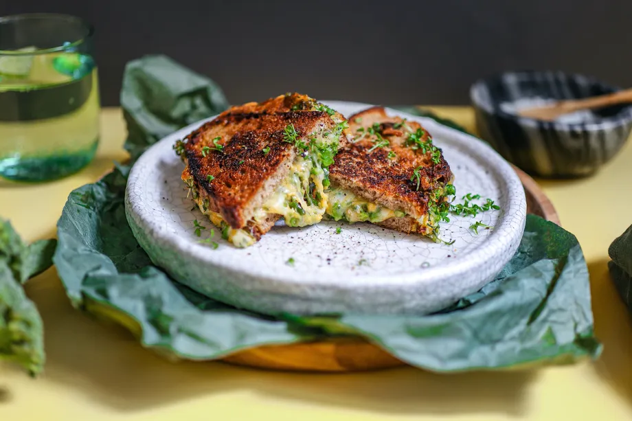

# Brokkoli Sandwiches

## Zutaten (2 Stück)

|            |              |
| ---------: | ------------ |
| 50 g       | Cheddar      |
| 60 g       | Brokkoli     |
|            | Butter       |
|            | Senf         |
|            | Öl           |
|            | Zitronensaft |
| 4 Scheiben | Brot         |
|            | Salz         |
|            | Pfeffer      |

Zubereitung

Den Käse reiben. Den gekochten Brokkoli grob mit einem Messer schneiden und mit dem Käse vermischen. Etwas salzen und kräftig pfeffern, einen Teelöffel Senf und einen Spritzer Zitronensaft untermischen. Nun die Rückseiten der Brote mit Butter bestreichen! Danach auch die Innenseiten leicht mit Butter bestreichen, die Käse-Brokkoli-Masse auf jeweils zwei Scheiben verteilen, eine Scheibe Brot darauflegen und andrücken. 

Nun eine große Pfanne erhitzen, einen Teelöffel Öl darin heiß werden lassen. Beide Brote in die Pfanne geben und auf kleiner Flamme braten, bis die Unterseite leicht gebräunt ist.  Dann die Brote wenden. Die Sandwiches ab und an mit einem Pfannenwender leicht nach unten drücken, sodass der langsam schmelzende Käse sich mit den Scheiben verbinden kann. 

Sobald der Käse sichtlich geschmolzen ist und beide Seiten der Brote knusprig sind, die gegrillten Sandwiches aus der Pfanne nehmen. Für einen frischen Kick mit etwas Brunnenkresse bestreuen und servieren.  