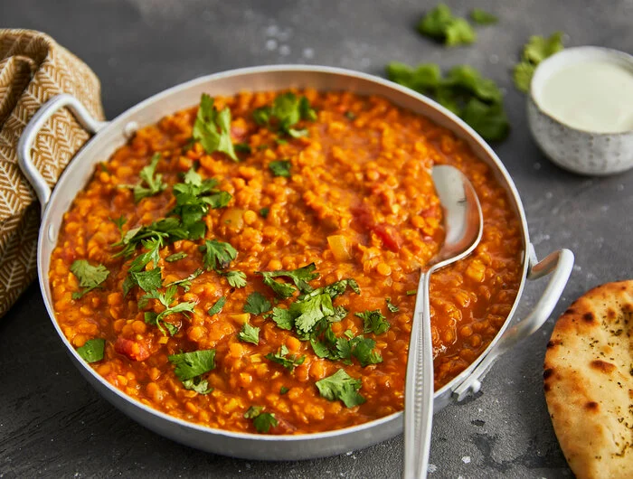

# Rotes Linsen Dal

Die vielen verschiedenen Gewürze lassen unser rotes Linsen-Dal zu einer Geschmacksexplosion werden. Cremig wird es durch Kokosmilch, die Fruchtnote kommt durch die Zugabe von Tomaten. Serviert wird das Dal mit frischem Kräutern und Naan-Brot – unkompliziert & lecker!

## Zutaten (4 Portionen)

|        |                           |
| ------:| ------------------------- |
| 2      | Zwiebeln                  |
| 4      | Knoblauchzehen            |
| 1 Stk. | Ingwer (daumengroß)       |
| 250 g  | rote Linsen               |
| 1 Bd.  | Koriander oder Petersilie |
| 1 TL   | Kurkuma gemahlen          |
| 1 TL   | Koriander gemahlen        |
| 1 TL   | Kreuzkümmel gemahlen      |
| 1 TL   | Paprikapulver gemahlen    |
| 1 TL   | Garam Masala              |
| 2 EL   | Rapsöl                    |
| 500 ml | Gemüsebrühe               |
| 200 g  | gehackte Tomaten (Dose)   |
| 200 ml | Kokosmilch                |
| 1 TL   | Ahornsirup                |
| 2 EL   | Limettensaft              |
|        | Pfeffer                   |
|        | Salz                      |

## Zubereitung

> **2** Zwiebeln, **4** Knoblauchzehen, **1 Stk.** Ingwer (daumengroß), **250 g** rote Linsen, **1 Bd.** Koriander oder Petersilie

Zwiebeln abziehen und würfeln, Knoblauch abziehen und hacken. Ingwer schälen und klein schneiden. Linsen in ein Sieb geben und abbrausen. Koriander bzw. Petersilie abbrausen, trockenschütteln und grob hacken.

---

> **1 TL** Kurkurma, **1 TL** Koriander, **1 TL** Kreuzkümmel, **1 TL** Paprikapulver, **1 TL** Garam Masala, **2 EL** Rapsöl, **500 ml** Gemüsebrühe

Die Gewürze (Kurkuma, Koriander, Kreuzkümmel, Paprikapulver und Garam Masala) in einem Schälchen vermischen. Das Rapsöl in einem großen Topf erhitzen und Zwiebelwürfel, Knoblauch und Ingwer darin **2-3 Minuten** braten. Dann die Gewürze und die roten Linsen dazugeben und kurz mit anschwitzen, mit der Gemüsebrühe ablöschen und einmal aufkochen lassen. Zugedeckt etwa **10 Minuten köcheln** lassen.

---

> **200 g** gehackte Tomaten, **200 ml** Kokosmilch, **1 TL** Ahornsirup, **2 EL** Limettensaft, Pfeffer, Salz

Gehackte Tomaten, Kokosmilch, Ahornsirup und Limettensaft unterrühren. Mit Pfeffer und etwas Jodsalz abschmecken und weitere **10 Minuten** offen köcheln lassen. Wenn das Dal zu dickflüssig ist, noch etwas Wasser oder gehackte Tomaten hinzugeben.

---

Fertiges Linsen-Dal auf 4 tiefe Teller verteilen, mit den gehackten Kräutern bestreuen und mit jeweils einem Naanbrot servieren.
