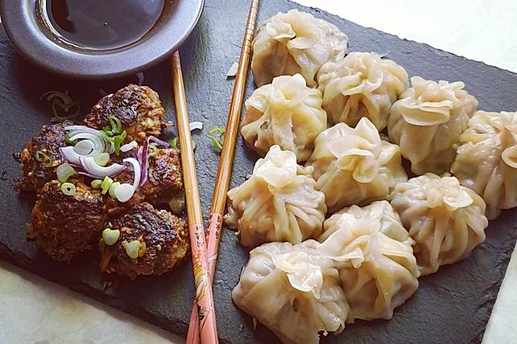

# chinesiche Dumpling, Potsticker

**Zubereitungszeit**: 1h 30min

## Zutaten (32 Stück)

|          |                   |
| -------: | ----------------- |
|    200 g | Mehl              |
|     1 TL | Salz              |
|   130 ml | Wasser            |
|          |                   |
|        1 | kleine Zucchini   |
|        1 | Karotte           |
|          | Chinakohl         |
| 1/2 Bund | Frühlingszwiebeln |
|   1 Zehe | Knoblauch         |
|     1 EL | Ingwer            |
|          | Sojasauce         |
|          |                   |
|    10 EL | Sojasauce         |
|     2 EL | Reisessig         |
|   1/2 EL | Seasamöl          |
|          | Sesam             |
|          | Chilisauce        |

## Zubereitung

Zuerst den Teig zubereiten:

Das Mehl und das Salz mischen und das kurz vorher aufgekochte Wasser langsam hinzugeben. Einfach zwei Essstäbchen zum Verrühren benutzen und, wenn der Teig gut gemischt ist, auf "mit den Händen kneten" umsteigen. Dann ist es auch nicht mehr problematisch mit dem anfangs heißen Wasser. Eine saubere und unkomplizierte Angelegenheit durch die Essstäbchen. Der Teig sollte dann wirklich mehrere Minuten lang durchgeknetet werden, dann wird er richtig weich und glatt.

---

Am Ende den Teig in zwei gleichgroße Kugeln formen. Dann die Erste nehmen. Diese zu einem langen, gleichförmigen Strang formen und zu einem Donut-Ring zusammenlegen. Die Enden aneinander pressen. Dasselbe mit der zweiten Teigkugel machen. Nun die Ringe nebeneinander auf z. B. ein Brettchen legen, abdecken und ruhen lassen.

---

In der Zwischenzeit die Füllung zubereiten:

Die Zucchini, Karotte, Ingwer und Knoblauch ganz klein würfeln. (Chinakohl und Frühlingszwiebel passt auch sehr gut, diese dann auch sehr klein schneiden.) Alles zum Hack geben.

---

Da ich viel nach Augenmaß koche, sind die Angaben jeweils anzupassen. Fie Gemüse-Hack-Masse sollte eine gute Konsistenz haben und zusammenhalten. Ich würde zu 1/3 Gemüse und 2/3 Hack tendieren damit dies gegeben ist. Wenn vorhanden jetzt einen kleinen Spritzer Sesamöl und einen Schuss Sojasoße hinzufügen. Mehr Gewürz braucht es nicht. Alles gut vermengen und beiseitestellen.

---

Jetzt den ersten Teigring in der Mitte mit einem Messer teilen und die beiden geradengezogenen Stränge parallel vor sich legen. Diese noch mal mittig teilen und wieder parallel zueinander legen, sodass man vier Teigstücke vor sich liegen hat. Nun diese in gleichmäßigem Abstand dreimal teilen. Es kommen so genau 16 ca. gleichgroße Teigstücke heraus.

---

Jedes Teigstück mit der Hand kurz platt drücken und etwas bemehlt beiseitelegen, dadurch ist es schon etwas vorgeformt. Dasselbe macht man mit dem zweiten Teigring und schon hat man 32 runde, gleichgroße Teigstücke vor sich liegen, die bearbeitet werden können. Man sollte immer etwas Mehl in der Nähe haben und nach Bedarf die Arbeitsplatte bestreuen.

---

Jeden einzelnen Teigfladen mithilfe eines Nudelholzes zu einem flachen Kreis ausrollen. Die fertigen Teigkreise sollten sehr dünn und gleichmäßig sein. Sie können bemehlt übereinandergestapelt werden oder man macht jeden Dumpling gleich fertig.

---

Jeden Teigkreis in die leicht hohl geformte Hand legen, sodass eine kleine Mulde entsteht. Nun etwas Füllung aus der Schüssel entnommen (am besten nimmt man sich ein normales Frühstücksmesser zu Hilfe) und in die Mitte setzen. Dann nimmt man den Daumen zu Hilfe und tut so, als würde man die Teigtasche zusammenklappen, lässt aber noch eine Lücke und drückt den Teig noch nicht aneinander. Dann von rechts nach links (oder umgekehrt für Linkshänder) den Teig fächerartig aneinander drücken. Die von einem entfernte Seite fächert sich Stück für Stück über die einem zugewandte, glatt bleibende Seite. Dadurch entsteht diese praktische Form des nicht umfallenden Dumplings. Am besten werden alle Dumplings auf einem bemehlten Teller gesammelt, möglichst ohne sich zu berühren.

---

Nun geht es im Rezept um die Pot-Sticker Version. Dies bedeutet, dass die Jiaozi angebraten werden, bevor man sie gart. Beim Braten muss man wegen der Menge in zwei Durchgängen arbeiten.

---

In einer Pfanne eine nicht zu kleine Menge Öl, wenn möglich Sesamöl, erhitzen. Die ersten 16 Dumplings aneinandergereiht hineinsetzen und sie von unten bräunen lassen. Wenn ein guter Bräunungsgrad nach wenigen Minuten erreicht ist, 100 ml Wasser hinzugeben, einen Deckel auf die Pfanne setzten und die Hitze auf kleine Temperatur herunter stellen. Die Dumplings garen innerhalb weniger Minuten durch.

---

In der Zwischenzeit die Dip-Zutaten in ein Schälchen geben (die Maßangabe sind nicht genau, alles frei nach Gefühl). Man kann auch etwas Frühlingszwiebel dazugeben oder gerösteten Sesam.

---

Die Dumplings aus der Pfanne nehmen, anrichten, bzw. warmgehalten während die nächste Portion brät.
