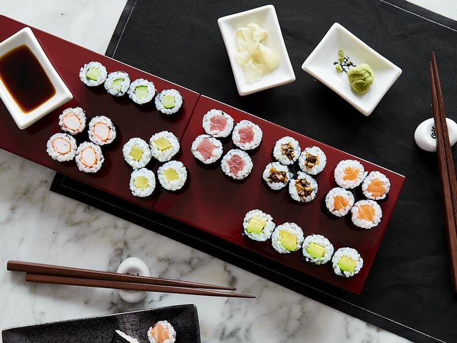

# Sushi Reis

Die simpelste Art der mittlerweile unzähligen Sushi Variationen ist die Hoso-Maki. Die „dünne Rolle“ wird aus einem halben Nori-Blatt gefertigt und besitzt nur eine einzige Zutat pro Maki. Die kleinen Röllchen sind einfach und schnell selber zu machen und du kannst sie mit den unterschiedlichsten Zutaten füllen. Aufgeschnitten und bunt durcheinander auf einem großen Teller oder Brett serviert, sehen die kleinen Reisteilchen nicht nur toll aus, sondern schmecken dazu auch einfach nur fantastisch. Der Reiz einer großen Sushi-Platte ist ja letztendlich die Vielfalt im Geschmack und die farbenfrohe Optik. Ich habe für die Hoso-Maki folgende Zutaten benutzt:

- Lachs
- Thunfisch
- Surimi (Krebsfleisch-Imitat)
- Salatgurke
- Avocado
- eingelegter Rettich
- eingelegte und gehackte Shiitake Pilze

Du kannst die Röllchen auch mit jedem anderen Fisch oder Gemüse füllen. Erlaubt ist, was dir schmeckt. Für eingelegten Rettich, Pilze, Ingwer und Co. mache am besten einen ausgiebigen Shopping-Trip in den Asialaden und lass dich inspirieren.

## Zutaten (6 Rollen)

|         |                               |
| ------: | ----------------------------- |
|   250 g | [Sushi Reis](./sushi_reis.md) |
| 3 Blatt | Nori                          |
|         | Gurke                         |
|         | Lachs                         |
|         | Avocado                       |
|         | Reisessig                     |

## Zubereitung

Nori-Blätter mit einem sehr scharfen Messer in der Mitte halbieren.

---

Halbes Nori-Blatt mit der rauen Seite nach oben auf die Bambusmatte legen. Kleine Schüssel mit kaltem Wasser, **2 EL** Reisessig füllen und vermischen.

---

Finger mit Essigwasser einreiben und ca. eine Handvoll Reis in die Mitte des Algenblatts legen. Mit den Fingern Reis vorsichtig und gleichmäßig auf dem Blatt verteilen. Darauf achten, den Reis nicht zu quetschen. ca. **2 cm** Platz am oberen Rand frei lassen.

---

Lachsstreifen längs auf unterem Drittel der Reisfläche verteilen. Daumen unter die Bambusmatte legen. Mit den restlichen Fingern den Lachs stabilisieren. Matte mit Nori-Blatt anheben und einrollen. Mit Hilfe der Matte leicht andrücken und Sushi-Rolle mit der Schnittkante nach unten auf ein Brett legen.

---

Pilze fein hacken. Avocado schälen und in fingerdicke Streifen schneiden.

---

Übrige Sushirollen auf die gleiche Weise mit Thunfisch-Streifen, Surimi, Pilzen, Avocado-Streifen, Rettich und Gurke zubereiten.

---

Enden mit einem sehr scharfen Messer abschneiden und Rollen in jeweils 4-6 Teile schneiden. Zusammen mit Sojasauce, Wasabi und eingelegtem Ingwer servieren.
