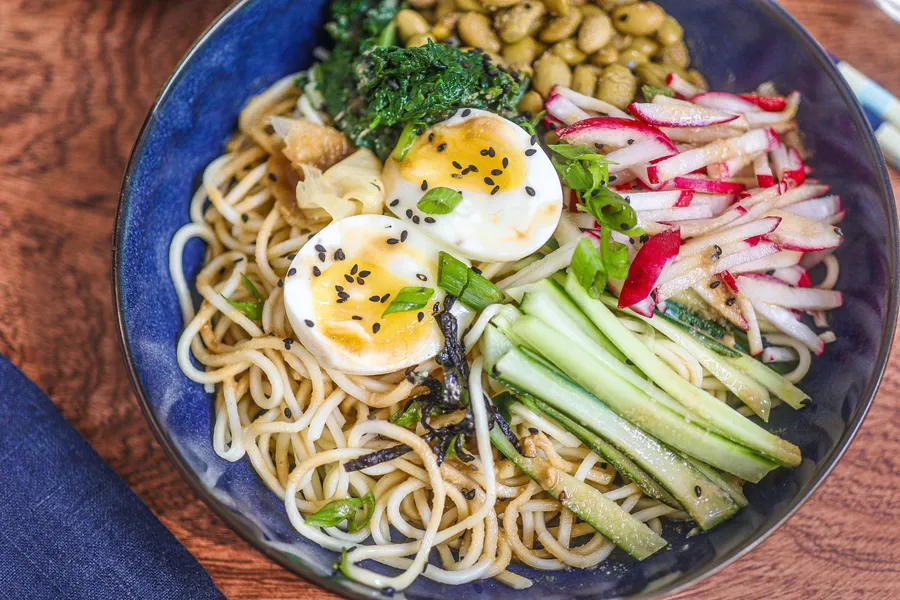

# Hiyashi Chuka

## Zutaten

|            |                    |
| ---------: | ------------------ |
|       200g | Ramen              |
|       200g | Blattspinat        |
|          2 | Eier               |
| 1 handvoll | Radieschen         |
|        1/2 | Gurke              |
|       100g | Edamame (TK)       |
|          1 | Frühlingszwiebel   |
|  1/2 Blatt | Nori (optional)    |
|            | Ingwer (eingelegt) |
|            | Sesam(optional)    |
|            |                    |
|       3 EL | Reisessig          |
|       3 TL | Tahin              |
|       2 EL | Sojasauce          |
|       2 EL | Mirin              |
|       1 EL | Sesamöl            |

## Zubereitung

Wer keine Ramen-Reste hat, kocht Ramen nach Packungsanleitung und schreckt sie danach eiskalt ab.

Zunächst das Gemüse vorbereiten. Den frischen Blattspinat waschen, in kochendem Wasser für **3 Minuten blanchieren** und anschließend mit einer Schöpfkelle in ein Sieb geben, dann kalt abschrecken. Im noch kochenden Wasser nun auch die TK-Edamame **3 Minuten kochen** lassen, mit einem Schöpflöffel herausnehmen und abschrecken. Danach die Eier in das kochende Wasser geben, **7 Minuten kochen** lassen und abschrecken.

In der Zwischenzeit Radieschen und Gurke waschen. Beides in dünne Streifen schneiden. Das Grün der Frühlingszwiebel in feine Ringe schneiden. Wer hat und mag, schneidet ein Noriblatt ebenfalls in feine Streifen.

Essig, Tahin, Sojasoße, Mirin und Sesamöl in einer kleinen Schüssel verrühren.

Die kalten Ramen mit Gemüse, Eiern und Frühlingszwiebeln in eine Schüssel geben. Wer mag, fügt eingelegten Sushi-Ingwer und Nori-Blätter hinzu. Das Dressing darübergießen und mit Sesamkörnern bestreuen.
