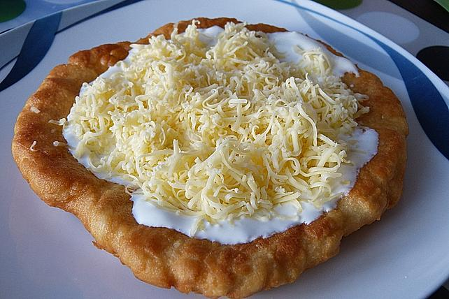

# Langos

**Zubereitungszeit**: 30 min

## Zutaten (6 Stück)

|         |               |
| ------: | ------------- |
|    400g | Mehl          |
|   250ml | Milch         |
|     15g | Hefe          |
|  1/2 TL | Salz          |
|    1/2l | Öl            |
|    200g | Creme fraîche |
| 2 Zehen | Knoblauch     |
|    150g | Gouda         |

## Zubereitung

Das Mehl in eine Schüssel geben. In die Mitte eine Mulde drücken. Die Hefe in 5 EL lauwarmer Milch auflösen und in die Mulde geben. Mit wenig Mehl zu einem Vorteig verrühren. Abdecken und 15 Minuten an einem warmen Ort gehen lassen. Danach Salz zufügen und während dem Kneten nach und nach knapp 250 ml lauwarme Milch dazu geben. Aber nur so viel, bis man einen festen Brotteig erhält. Den Teig mit wenig Mehl bestäuben, abdecken und ca. 30 Minuten an einem warmen Ort gehen lassen.

---

Den Teig in 6 Stücke teilen, zu Kugeln formen und mit der Hand zu dünnen Fladen auseinander ziehen, wobei der Rand etwas dicker als die Mitte sein sollte. In einer beschichteten Pfanne Öl erhitzen und die Lángos in ca. 2-3 Minuten pro Seite hellbraun ausbacken.

---

Crème fraîche in eine Schüssel geben, glatt rühren und mit etwas Salz würzen. Für das Knoblauchöl den Knoblauch schälen, in eine kleine Schüssel pressen und ein wenig Öl dazu gießen. Den Käse reiben.

Die Lángos möglichst warm servieren. Mit Knoblauchöl und Crème fraîche bestreichen und mit geriebenem Käse bestreuen.
