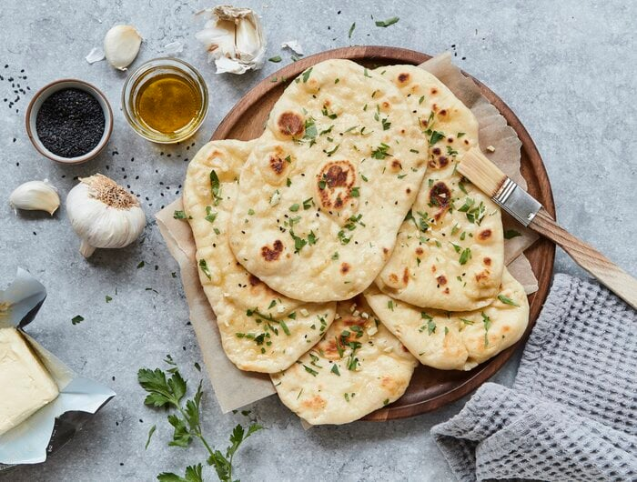

# Veganes Naan Brot

## Zutaten (6 Stück)

|       |                           |
| ----: | ------------------------- |
| 60 ml | Wasser                    |
|   4 g | Trockenhefe               |
|  1 TL | Agavendicksaft/Ahornsirup |
| 300 g | Weizen- oder Dinkelmehl   |
| 100 g | Sojajoghurt               |
|  2 EL | Olivenöl                  |
|  1 TL | Salz                      |
|  5 EL | Olivenöl (zum Braten)     |

## Zubereitung

> **60 ml** lauwarmes Wasser **4 g** Trockenhefe, **1 TL** Agavendicksaft,**300 g** Mehl, **2 TL** Öl, **100 g** Sojajoghurt, **1 TL** Salz

Wasser, Trockenhefe und Agavendicksaft verrühren und **10 Minuten** beiseitestellen. Dabei wird die Hefe aktiviert und es sollten kleine Bläschen an der Oberfläche zu sehen sein. Dann Sojajoghurt, Meersalz, Olivenöl und Mehl dazugeben und das ganze 5 Minuten lang mit dem Knethaken der Küchenmaschine oder den Händen zu einem samtigen Teig kneten. Der Teig ist fertig, sobald er sich vom Schüsselrand löst und sich weich anfühlt. Mit einem Küchentuch abdecken und an einem warmen Ort **60 Minuten** gehen lassen.

---

Den Teig aus der Schüssel auf eine leicht bemehlte Arbeitsfläche geben und in 6 gleichgroße Stücke zerteilen. Jedes Stück noch einmal etwas rund formen und dann zu ovalen, dünnen Fladen ausrollen. Dabei gerade so viel Mehl verwenden, dass der Teig nicht an der Arbeitsfläche kleben bleibt.

---

> **5 EL** Ölivenöl

Die heiße Pfanne mit einer dünnen Schicht Olivenöl austreichen und das Naan von beiden Seiten goldbraun anbraten. Der Fladen kann das erste Mal gewendet werden, wenn die Teigoberfläche kleine Blasen bildet. Vor dem Wenden, die noch "unangebratene" Seite mit etwas Olivenöl bestreichen. Aus der Pfanne heben, mit Knoblauchbutter einpinseln und gehackter Petersilie bestreuen.
