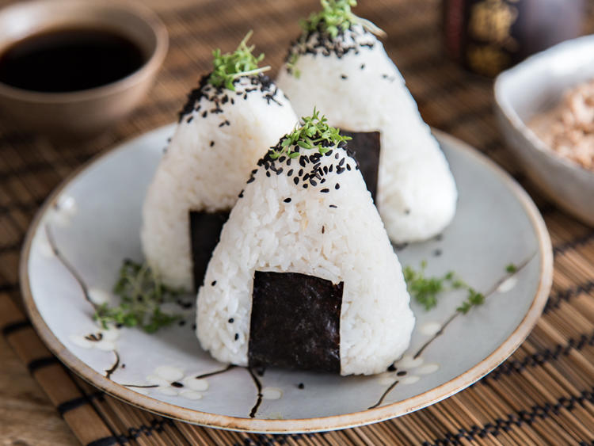

# Onigiri

 

Mein Snack der hat drei Ecken, drei Ecken hat mein Snack. Gemeint sind hier Onigiri. Die kleinen meist dreieckigen Happen aus Sushireis werden in der japanischen Küche vielfältig gefüllt. Mit Nori umwickelt machst du sie ganz einfach zum sättigenden Snack. Das japanische Pendant zum deutschen Pausenbrot quasi. Bei deiner Onigiri-Füllung hast du die Qual der Wahl. Du kannst sie wie hier mit leckerem Thunfischmix füllen. Oder angebratene Hähnchenbrust, Avocado oder Lachsfilet darin verstecken. Erlaubt ist, was dir schmeckt.

**Zubereitungszeit**: 20 min

## Zutaten

|               |                   |
| ------------: | ----------------- |
|         500 g | Sushi Reis        |
|        1/2 TL | Salz              |
|          2 EL | Reisessig         |
|          1 EL | Zucker            |
|          1 TL | Sesamöl           |
|          1 TL | schwarzer Sesam   |
|        250 ml | Wasser            |
|       2 Blatt | Nori              |
|               |                   |
|           1/2 | Gurke             |
|          3 EL | Frischkäse        |
|          2 TL | Sesamöl           |
|          2 TL | weiße Sesamkörner |
| 1 Stück (1cm) | Ingwer            |
|          1 TL | Soja Sauce        |
|               | Salz              |
|               | Zucker            |
|               | MSG               |

## Zubereitung

Sushi Reis unter kaltem Wasser abspülen und in einem Topf mit Wasser aufkochen. Topf mit Deckel abdecken, Hitze reduzieren und Reis ca. 15 Minuten quellen lassen, bis der Reis die Flüssigkeit aufgenommen hat.

Topf vom Herd nehmen und Reis ca. 5 Minuten bei geschlossenem Deckel ruhen lassen. Mit einer Gabel auflockern, Topf erneut abdecken und weitere 5 Minuten ruhen lassen. Essig, Zucker, Salz und Sesamöl untermengen. Reis auf Zimmertemperatur auskühlen lassen.

---

Füllung vorbereiten: Gurke schälen, der Länge nach halbieren und Kerne mit einem kleinem Löffel entfernen.
Den Rest sehr klein würfeln und mit Frischkäse und Gewürzen verrühren.

Um die Onigiri herzustellen, ist ein Onigiri-Former praktisch.
Zur Hälfte mit Reis füllen, einen kleinen Löffel Füllung in die Mitte geben und mit Reis bedecken.
Deckel aufsetzen, gut zusammendrücken, Deckel wieder abnehmen und die Onigiri vorsichtig herausstürzen.
Finger immer wieder anfeuchten, damit der Reis nicht zu sehr daran klebt.

Nori in breite Streifen schneiden. Onigiri auswickeln und je mit einem Streifen Nori und schwarzem Sesam garnieren.
